# Diagram Architektury UI - Moduł Autentykacji

## Opis diagramu

Diagram przedstawia kompleksową architekturę interfejsu użytkownika dla modułu autentykacji aplikacji "Szybkie Kalorie". Obejmuje strony Astro (SSR), komponenty React, API endpoints, services, helpers oraz integrację z Supabase Auth.

## Legenda kolorów

- **🟢 Zielony** - Nowe komponenty (do utworzenia)
- **🟠 Pomarańczowy** - Aktualizowane komponenty (wymagają zmian)
- **⚪ Szary** - Istniejące komponenty (bez zmian)
- **🔵 Niebieski** - Layouty
- **🟡 Żółty** - Komponenty UI (shadcn/ui)
- **🟣 Fioletowy** - Services
- **🟠 Pomarańczowy (API)** - API Endpoints
- **🔴 Czerwony** - Baza danych i Supabase

## Główne grupy funkcjonalne

1. **Middleware Layer** - odświeżanie sesji
2. **Layouts** - AuthLayout (nowy) i Layout (istniejący)
3. **Chronione Strony** - dashboard, settings, day details (z auth guard)
4. **Strony Autentykacji** - signup, login, forgot-password, reset-password, callback
5. **Formularze React Auth** - SignupForm, LoginForm, ForgotPasswordForm, ResetPasswordForm, ChangePasswordDialog
6. **Komponenty Istniejące** - Settings, Dashboard, DayDetails
7. **API Endpoints** - 6 nowych endpointów auth
8. **Services & Helpers** - AuthService, auth.helpers, validation schemas

## Diagram

```mermaid
flowchart TD
    %% ========================================
    %% LEGENDA KOLORÓW
    %% ========================================
    classDef newComponent fill:#a8e6cf,stroke:#56ab91,stroke-width:3px
    classDef updatedComponent fill:#ffd3b6,stroke:#ffaa71,stroke-width:3px
    classDef existingComponent fill:#e0e0e0,stroke:#9e9e9e,stroke-width:2px
    classDef layoutComponent fill:#dceefb,stroke:#4a90e2,stroke-width:2px
    classDef apiComponent fill:#ffe9d6,stroke:#ff8c42,stroke-width:2px
    classDef serviceComponent fill:#e6ccff,stroke:#9d4edd,stroke-width:2px
    classDef uiComponent fill:#fff4cc,stroke:#ffd000,stroke-width:2px
    classDef dbComponent fill:#ffd9e6,stroke:#e91e63,stroke-width:2px

    %% ========================================
    %% MIDDLEWARE LAYER
    %% ========================================
    subgraph MIDDLEWARE["🔧 Middleware Layer"]
        MW[Middleware index.ts<br/>- Udostępnia Supabase client<br/>- Odświeża sesję z cookies<br/>AKTUALIZOWANE]:::updatedComponent
    end

    %% ========================================
    %% LAYOUTS
    %% ========================================
    subgraph LAYOUTS["📐 Layouts"]
        MainLayout[Layout.astro<br/>Główny layout<br/>ISTNIEJĄCE]:::existingComponent
        AuthLayout[AuthLayout.astro<br/>Layout dla stron auth<br/>NOWE]:::newComponent
    end

    %% ========================================
    %% STRONY CHRONIONE (Protected Pages)
    %% ========================================
    subgraph PROTECTED["🔒 Chronione Strony - SSR z Auth Guard"]
        PageIndex[index.astro<br/>Dashboard<br/>AKTUALIZOWANE - auth guard]:::updatedComponent
        PageSettings[settings.astro<br/>Ustawienia<br/>AKTUALIZOWANE - auth guard]:::updatedComponent
        PageDay[day/date.astro<br/>Szczegóły dnia<br/>AKTUALIZOWANE - auth guard]:::updatedComponent
    end

    %% ========================================
    %% STRONY AUTENTYKACJI (Auth Pages)
    %% ========================================
    subgraph AUTHPAGES["🔐 Strony Autentykacji - SSR"]
        PageSignup[auth/signup.astro<br/>Rejestracja<br/>NOWE]:::newComponent
        PageLogin[auth/login.astro<br/>Logowanie<br/>NOWE]:::newComponent
        PageForgot[auth/forgot-password.astro<br/>Reset hasła<br/>NOWE]:::newComponent
        PageReset[auth/reset-password.astro<br/>Nowe hasło<br/>NOWE]:::newComponent
        PageCallback[auth/callback.astro<br/>Callback Supabase<br/>NOWE]:::newComponent
    end

    %% ========================================
    %% KOMPONENTY REACT - AUTH FORMS
    %% ========================================
    subgraph AUTHFORMS["⚛️ Komponenty React - Formularze Auth"]
        FormSignup[SignupForm.tsx<br/>- Email, hasło, potwierdzenie<br/>- Walidacja client-side<br/>NOWE]:::newComponent
        FormLogin[LoginForm.tsx<br/>- Email, hasło<br/>- Link do forgot password<br/>NOWE]:::newComponent
        FormForgot[ForgotPasswordForm.tsx<br/>- Email<br/>- Success state<br/>NOWE]:::newComponent
        FormReset[ResetPasswordForm.tsx<br/>- Nowe hasło, potwierdzenie<br/>- Token validation<br/>NOWE]:::newComponent
        DialogChange[ChangePasswordDialog.tsx<br/>- Aktualne hasło<br/>- Nowe hasło + potwierdzenie<br/>NOWE]:::newComponent
    end

    %% ========================================
    %% KOMPONENTY REACT - ISTNIEJĄCE
    %% ========================================
    subgraph EXISTINGREACT["⚛️ Komponenty React - Istniejące"]
        CompSettings[Settings.tsx<br/>Główny komponent ustawień<br/>AKTUALIZOWANE - karta Zmień hasło]:::updatedComponent
        CompLogout[LogoutAlertDialog.tsx<br/>Dialog wylogowania<br/>AKTUALIZOWANE - nowy endpoint]:::updatedComponent
        CompDashboard[Dashboard.tsx<br/>ISTNIEJĄCE]:::existingComponent
        CompDayDetails[DayDetails.tsx<br/>ISTNIEJĄCE]:::existingComponent
    end

    %% ========================================
    %% KOMPONENTY WSPÓLNE AUTH UI
    %% ========================================
    subgraph AUTHUI["🎨 Komponenty Wspólne - Auth UI"]
        CompFooter[AuthFormFooter.tsx<br/>Footer z linkami<br/>NOWE]:::newComponent
        CompPasswordInput[PasswordInput.tsx<br/>Input z toggle<br/>NOWE]:::newComponent
    end

    %% ========================================
    %% SHADCN UI COMPONENTS
    %% ========================================
    subgraph SHADCN["🎨 Shadcn/ui Components"]
        UIButton[Button]:::uiComponent
        UIInput[Input]:::uiComponent
        UILabel[Label]:::uiComponent
        UIDialog[Dialog]:::uiComponent
        UIAlert[Alert]:::uiComponent
        UIAlertDialog[AlertDialog]:::uiComponent
        UISeparator[Separator]:::uiComponent
    end

    %% ========================================
    %% HOOKS
    %% ========================================
    subgraph HOOKS["🪝 React Hooks"]
        HookAuth[useAuth.ts<br/>- Stan autentykacji<br/>- onAuthStateChange<br/>NOWE]:::newComponent
        HookSettings[useSettings.ts<br/>ISTNIEJĄCE]:::existingComponent
        HookTheme[useTheme.ts<br/>ISTNIEJĄCE]:::existingComponent
    end

    %% ========================================
    %% API ENDPOINTS
    %% ========================================
    subgraph APIAUTH["🔌 API Endpoints - Auth"]
        APISignup[POST /api/v1/auth/signup<br/>Rejestracja użytkownika<br/>NOWE]:::apiComponent
        APILogin[POST /api/v1/auth/login<br/>Logowanie<br/>NOWE]:::apiComponent
        APILogout[POST /api/v1/auth/logout<br/>Wylogowanie<br/>NOWE]:::apiComponent
        APIForgot[POST /api/v1/auth/forgot-password<br/>Żądanie resetu<br/>NOWE]:::apiComponent
        APIReset[POST /api/v1/auth/reset-password<br/>Reset hasła<br/>NOWE]:::apiComponent
        APIChange[POST /api/v1/auth/change-password<br/>Zmiana hasła<br/>NOWE]:::apiComponent
    end

    %% ========================================
    %% SERVICES & LOGIC
    %% ========================================
    subgraph SERVICES["⚙️ Services & Logic"]
        ServiceAuth[auth.service.ts<br/>- signUp, signIn, signOut<br/>- resetPassword, changePassword<br/>- mapAuthError<br/>NOWE]:::serviceComponent
        ServiceProfile[profile.service.ts<br/>ISTNIEJĄCE]:::existingComponent
        ServiceMeals[meals.service.ts<br/>ISTNIEJĄCE]:::existingComponent
    end

    %% ========================================
    %% HELPERS & VALIDATION
    %% ========================================
    subgraph HELPERS["🛠️ Helpers & Validation"]
        HelperAuth[auth.helpers.ts<br/>- requireAuth<br/>- getAuthUser<br/>- redirectIfAuthenticated<br/>NOWE]:::newComponent
        SchemaAuth[auth.schemas.ts<br/>Zod schemas<br/>NOWE]:::newComponent
        TypesAuth[auth.types.ts<br/>TypeScript types<br/>NOWE]:::newComponent
    end

    %% ========================================
    %% SUPABASE & DATABASE
    %% ========================================
    subgraph SUPABASE["🗄️ Supabase & Database"]
        SupaAuth[Supabase Auth<br/>- signUp, signInWithPassword<br/>- resetPasswordForEmail<br/>- updateUser<br/>- Session management]:::dbComponent
        SupaDB[PostgreSQL Database<br/>- auth.users<br/>- public.profiles<br/>- Trigger: handle_new_user]:::dbComponent
    end

    %% ========================================
    %% RELATIONSHIPS - MIDDLEWARE
    %% ========================================
    MW -->|"Udostępnia client w locals"| PROTECTED
    MW -->|"Udostępnia client w locals"| AUTHPAGES

    %% ========================================
    %% RELATIONSHIPS - LAYOUTS
    %% ========================================
    MainLayout -->|"Renderuje"| PageIndex
    MainLayout -->|"Renderuje"| PageSettings
    MainLayout -->|"Renderuje"| PageDay
    AuthLayout -->|"Renderuje"| PageSignup
    AuthLayout -->|"Renderuje"| PageLogin
    AuthLayout -->|"Renderuje"| PageForgot
    AuthLayout -->|"Renderuje"| PageReset

    %% ========================================
    %% RELATIONSHIPS - PROTECTED PAGES
    %% ========================================
    PageIndex -->|"Używa requireAuth"| HelperAuth
    PageSettings -->|"Używa requireAuth"| HelperAuth
    PageDay -->|"Używa requireAuth"| HelperAuth
    PageSettings -->|"Renderuje"| CompSettings
    PageIndex -->|"Renderuje"| CompDashboard
    PageDay -->|"Renderuje"| CompDayDetails

    %% ========================================
    %% RELATIONSHIPS - AUTH PAGES → FORMS
    %% ========================================
    PageSignup -->|"Renderuje"| FormSignup
    PageLogin -->|"Renderuje"| FormLogin
    PageForgot -->|"Renderuje"| FormForgot
    PageReset -->|"Renderuje"| FormReset
    PageSignup -->|"Używa redirectIfAuth"| HelperAuth
    PageLogin -->|"Używa redirectIfAuth"| HelperAuth

    %% ========================================
    %% RELATIONSHIPS - FORMS → API
    %% ========================================
    FormSignup -->|"POST request"| APISignup
    FormLogin -->|"POST request"| APILogin
    FormForgot -->|"POST request"| APIForgot
    FormReset -->|"POST request"| APIReset
    DialogChange -->|"POST request"| APIChange
    CompLogout -->|"POST request"| APILogout

    %% ========================================
    %% RELATIONSHIPS - FORMS → UI
    %% ========================================
    FormSignup -->|"Używa"| CompPasswordInput
    FormSignup -->|"Używa"| CompFooter
    FormLogin -->|"Używa"| CompPasswordInput
    FormLogin -->|"Używa"| CompFooter
    FormReset -->|"Używa"| CompPasswordInput
    DialogChange -->|"Używa"| CompPasswordInput

    FormSignup -->|"Używa"| UIButton
    FormSignup -->|"Używa"| UIInput
    FormSignup -->|"Używa"| UILabel
    FormSignup -->|"Używa"| UIAlert
    FormLogin -->|"Używa"| UIButton
    FormLogin -->|"Używa"| UIInput
    FormForgot -->|"Używa"| UIButton
    FormForgot -->|"Używa"| UIInput
    FormReset -->|"Używa"| UIButton
    FormReset -->|"Używa"| UIInput
    DialogChange -->|"Używa"| UIDialog
    DialogChange -->|"Używa"| UIButton
    DialogChange -->|"Używa"| UIInput

    %% ========================================
    %% RELATIONSHIPS - SETTINGS
    %% ========================================
    CompSettings -->|"Renderuje"| DialogChange
    CompSettings -->|"Renderuje"| CompLogout
    CompSettings -->|"Używa"| HookSettings
    CompSettings -->|"Używa"| HookTheme

    %% ========================================
    %% RELATIONSHIPS - API → SERVICES
    %% ========================================
    APISignup -->|"Używa"| ServiceAuth
    APILogin -->|"Używa"| ServiceAuth
    APILogout -->|"Używa"| ServiceAuth
    APIForgot -->|"Używa"| ServiceAuth
    APIReset -->|"Używa"| ServiceAuth
    APIChange -->|"Używa"| ServiceAuth

    %% ========================================
    %% RELATIONSHIPS - API → VALIDATION
    %% ========================================
    APISignup -->|"Walidacja"| SchemaAuth
    APILogin -->|"Walidacja"| SchemaAuth
    APIForgot -->|"Walidacja"| SchemaAuth
    APIReset -->|"Walidacja"| SchemaAuth
    APIChange -->|"Walidacja"| SchemaAuth

    %% ========================================
    %% RELATIONSHIPS - SERVICES → SUPABASE
    %% ========================================
    ServiceAuth -->|"signUp, signIn, etc."| SupaAuth
    SupaAuth -->|"Tworzy user, session"| SupaDB
    SupaDB -->|"Trigger: handle_new_user"| ServiceProfile

    %% ========================================
    %% RELATIONSHIPS - HOOKS
    %% ========================================
    HookAuth -->|"getSession, onAuthStateChange"| SupaAuth
    FormSignup -->|"Opcjonalnie używa"| HookAuth
    FormLogin -->|"Opcjonalnie używa"| HookAuth
    CompSettings -->|"Opcjonalnie używa"| HookAuth

    %% ========================================
    %% RELATIONSHIPS - TYPES
    %% ========================================
    TypesAuth -.->|"Typy dla"| AUTHFORMS
    TypesAuth -.->|"Typy dla"| APIAUTH
    TypesAuth -.->|"Typy dla"| ServiceAuth

    %% ========================================
    %% EMAIL FLOW
    %% ========================================
    SupaAuth -->|"Wysyła email reset"| PageCallback
    PageCallback -->|"Redirect"| PageReset
```

## Kluczowe przepływy

### 1. Przepływ rejestracji (Signup Flow)

1. User odwiedza `/auth/signup` → **PageSignup** (Astro SSR)
2. **PageSignup** renderuje **SignupForm** (React)
3. User wypełnia formularz → **SignupForm** → POST `/api/v1/auth/signup`
4. **APISignup** → **ServiceAuth** → **SupaAuth** → Tworzy użytkownika w DB
5. **Trigger** `handle_new_user` → Tworzy profil w `public.profiles`
6. Auto-login → Redirect na `/settings` (US-004: pierwsze ustawienie celu)

### 2. Przepływ logowania (Login Flow)

1. User odwiedza `/auth/login` → **PageLogin** (Astro SSR)
2. **PageLogin** renderuje **LoginForm** (React)
3. User wypełnia formularz → **LoginForm** → POST `/api/v1/auth/login`
4. **APILogin** → **ServiceAuth** → **SupaAuth** → Weryfikacja credentials
5. Ustawienie cookies sesji (30 dni)
6. Redirect na `/` (Dashboard)

### 3. Przepływ resetu hasła (Password Reset Flow)

1. User odwiedza `/auth/forgot-password` → **PageForgot**
2. **PageForgot** renderuje **ForgotPasswordForm**
3. User podaje email → POST `/api/v1/auth/forgot-password`
4. **APIForgot** → **ServiceAuth** → **SupaAuth** → Wysyła email z linkiem
5. User klika link w emailu → Supabase redirect na `/auth/callback`
6. **PageCallback** → Wymiana tokenu na sesję → Redirect na `/auth/reset-password`
7. **PageReset** renderuje **ResetPasswordForm**
8. User ustawia nowe hasło → POST `/api/v1/auth/reset-password`
9. Redirect na `/auth/login?success=password_reset`

### 4. Przepływ zmiany hasła w ustawieniach (Change Password Flow)

1. User w `/settings` → **CompSettings** → Klikam "Zmień hasło"
2. Otwiera się **ChangePasswordDialog**
3. User wypełnia 3 pola (aktualne, nowe, potwierdzenie)
4. Submit → POST `/api/v1/auth/change-password`
5. **APIChange** → **ServiceAuth** → **SupaAuth** → Re-authentication + update hasła
6. Zamknięcie dialogu + Toast sukcesu

### 5. Auth Guard dla chronionych stron

1. User próbuje odwiedzić `/`, `/settings`, `/day/[date]`
2. **Middleware** → Odświeża sesję z cookies
3. Strona Astro → Wywołuje `requireAuth` helper
4. **HelperAuth** → Sprawdza `locals.supabase.auth.getUser()`
5. Jeśli brak użytkownika → Redirect `/auth/login`
6. Jeśli użytkownik istnieje → Renderuje stronę

## Szczegóły implementacyjne

### Nowe komponenty do utworzenia

#### Strony Astro (5 plików)

1. `/src/pages/auth/signup.astro` - Strona rejestracji
2. `/src/pages/auth/login.astro` - Strona logowania
3. `/src/pages/auth/forgot-password.astro` - Żądanie resetu hasła
4. `/src/pages/auth/reset-password.astro` - Ustawienie nowego hasła
5. `/src/pages/auth/callback.astro` - Callback Supabase (PKCE flow)

#### Layout (1 plik)

1. `/src/layouts/AuthLayout.astro` - Dedykowany layout dla stron auth

#### Komponenty React (7 plików)

1. `/src/components/auth/SignupForm.tsx` - Formularz rejestracji
2. `/src/components/auth/LoginForm.tsx` - Formularz logowania
3. `/src/components/auth/ForgotPasswordForm.tsx` - Formularz żądania resetu
4. `/src/components/auth/ResetPasswordForm.tsx` - Formularz nowego hasła
5. `/src/components/settings/ChangePasswordDialog.tsx` - Dialog zmiany hasła
6. `/src/components/auth/AuthFormFooter.tsx` - Footer z linkami
7. `/src/components/auth/PasswordInput.tsx` - Input z toggle show/hide

#### API Endpoints (6 plików)

1. `/src/pages/api/v1/auth/signup.ts` - POST endpoint rejestracji
2. `/src/pages/api/v1/auth/login.ts` - POST endpoint logowania
3. `/src/pages/api/v1/auth/logout.ts` - POST endpoint wylogowania
4. `/src/pages/api/v1/auth/forgot-password.ts` - POST endpoint żądania resetu
5. `/src/pages/api/v1/auth/reset-password.ts` - POST endpoint resetu hasła
6. `/src/pages/api/v1/auth/change-password.ts` - POST endpoint zmiany hasła

#### Services & Utilities (4 pliki)

1. `/src/lib/services/auth.service.ts` - Logika biznesowa autentykacji
2. `/src/lib/helpers/auth.helpers.ts` - Funkcje pomocnicze (requireAuth, etc.)
3. `/src/lib/validation/auth.schemas.ts` - Zod schemas dla walidacji
4. `/src/types/auth.types.ts` - Definicje typów TypeScript

#### Hooks (1 plik)

1. `/src/hooks/useAuth.ts` - Hook do zarządzania stanem autentykacji

### Aktualizowane komponenty

1. **`/src/pages/index.astro`** - Dodanie auth guard
2. **`/src/pages/settings.astro`** - Dodanie auth guard
3. **`/src/pages/day/[date].astro`** - Dodanie auth guard
4. **`/src/components/settings/Settings.tsx`** - Dodanie karty "Zmień hasło"
5. **`/src/components/settings/LogoutAlertDialog.tsx`** - Zmiana endpointa na `/api/v1/auth/logout`
6. **`/src/middleware/index.ts`** - Dodanie odświeżania sesji

## Podsumowanie

Diagram przedstawia kompletną architekturę modułu autentykacji zgodnie z wymaganiami US-001, US-002, US-003 i US-003a. System jest zaprojektowany z naciskiem na:

- **Bezpieczeństwo**: Server-side rendering dla sprawdzenia sesji, hashowanie haseł przez Supabase
- **UX**: Szybkie przepływy, jasne komunikaty błędów, auto-login po rejestracji
- **Separation of Concerns**: Wyraźny podział na strony (routing), formularze (UI), API (endpoints), logikę (services)
- **Reużywalność**: Wspólne komponenty UI (AuthFormFooter, PasswordInput), shadcn/ui
- **Maintainability**: TypeScript types, Zod validation, helpers dla wspólnej logiki
